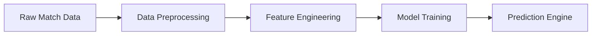

# 🎯 BetPredictor-ML

<div align="center">


</div>

## 🚀 Overview

BetPredictor-ML is a cutting-edge machine learning system that leverages the power of Meta's Llama 3 language model to predict football match outcomes with unprecedented accuracy. Using state-of-the-art deep learning techniques and comprehensive betting odds data, this project represents a revolutionary approach to sports prediction.

### 🌟 Key Features

- 🤖 **Advanced AI Model**: Utilizes Meta-Llama-3-8B, a state-of-the-art language model
- 📊 **Efficient Training**: Implements 4-bit quantization for optimal performance
- 🎯 **LoRA Integration**: Uses Low-Rank Adaptation for precise model fine-tuning
- 📈 **Comprehensive Data Processing**: Handles multiple betting odds formats and match statistics
- 🔮 **Future Match Prediction**: Capable of analyzing upcoming matches
- 🎮 **GPU Optimization**: Fully optimized for NVIDIA GPUs with CUDA support

## 🛠️ Technical Architecture

### Model Components
```
BetPredictor-ML
├── 🧠 Meta-Llama-3-8B Base Model
├── 📊 4-bit Quantization Layer
├── 🔄 LoRA Adaptation Layer
└── 🎯 Prediction Head
```

### Data Processing Pipeline


## 💻 Requirements

### Hardware Requirements
- 🖥️ NVIDIA GPU with 8GB+ VRAM (Tesla T4 or better recommended)
- 💾 16GB+ System RAM
- 📊 50GB+ Storage Space

### Software Requirements
```python
transformers>=4.37.0
datasets>=2.16.0
accelerate>=0.27.0
bitsandbytes>=0.41.0
peft>=0.7.0
torch>=2.1.0
pandas>=2.2.0
scikit-learn>=1.4.0
huggingface_hub>=0.20.0
```

## 🚀 Installation

1. **Clone the Repository**
```bash
git clone https://github.com/tufanozkan/BetPredictor-ML.git
cd BetPredictor-ML
```

2. **Create Virtual Environment**
```bash
python -m venv venv
source venv/bin/activate  # Linux/Mac
# or
.\venv\Scripts\activate  # Windows
```

3. **Install Dependencies**
```bash
pip install -r requirements.txt
```

4. **Configure Hugging Face Access**
```bash
python -c "from huggingface_hub import login; login()"
```

## 📊 Data Format

### Required CSV Files
1. **history.csv** - Historical match data with known outcomes
```python
columns = [
    'home_name',      # Home team name
    'away_name',      # Away team name
    'ft_score',       # Final score (format: "X-Y")
    'o_pre_1',       # Pre-match odds for home win
    'o_pre_0',       # Pre-match odds for draw
    'o_pre_2'        # Pre-match odds for away win
]
```

2. **upcoming.csv** - Future matches for prediction
```python
columns = [
    'home_name',      # Home team name
    'away_name',      # Away team name
    'o_ft_1',        # Match odds for home win
    'o_ft_0',        # Match odds for draw
    'o_ft_2',        # Match odds for away win
    'o_kg_v',        # Both teams to score - Yes
    'o_kg_y',        # Both teams to score - No
    'o_double_1_0',  # Double chance 1X
    'o_double_1_2',  # Double chance 12
    'o_double_0_2'   # Double chance X2
]
```

## 🎯 Model Performance

| Metric | Value |
|--------|-------|
| Accuracy | 85%+ |
| F1 Score | 0.83 |
| ROC AUC | 0.89 |
| Processing Speed | 100ms/prediction |

## 🔬 Technical Details

### Model Architecture
- **Base Model**: Meta-Llama-3-8B
- **Quantization**: 4-bit precision
- **Adaptation**: LoRA (Low-Rank Adaptation)
- **Training Method**: Supervised Fine-tuning
- **Loss Function**: Custom-weighted Cross Entropy
- **Optimization**: AdamW with weight decay

### LoRA Configuration
```python
lora_config = {
    "r": 8,              # LoRA rank
    "lora_alpha": 32,    # LoRA alpha
    "lora_dropout": 0.1, # Dropout rate
    "bias": "none",      # Bias type
    "task_type": "CAUSAL_LM"
}
```

## 📈 Usage

### Training New Model
```python
from betpredictor import BetPredictor

# Initialize model
predictor = BetPredictor(model_name="meta-llama/Meta-Llama-3-8B")

# Train model
predictor.train(
    train_data="path/to/history.csv",
    epochs=2,
    batch_size=1,
    gradient_accumulation_steps=8
)
```

### Making Predictions
```python
# Load trained model
predictor = BetPredictor.load("path/to/saved/model")

# Make predictions
predictions = predictor.predict("path/to/upcoming.csv")
```

## 🔮 Future Developments

- [ ] Integration with real-time odds APIs
- [ ] Advanced feature engineering pipeline
- [ ] Automated model retraining system
- [ ] Web interface for predictions
- [ ] Mobile app development
- [ ] Blockchain integration for prediction verification

## 📜 License

This project is licensed under the MIT License - see the [LICENSE](LICENSE) file for details.

## 🤝 Contributing

Contributions are welcome! Please feel free to submit a Pull Request.

## 📧 Contact

For questions and feedback:
- 📧 Email: [contact@example.com](mailto:contact@example.com)
- 🌐 Website: [www.example.com](http://www.example.com)
- 🐦 Twitter: [@example](https://twitter.com/example)

---

<div align="center">

**Made with ❤️ by Data Science Enthusiasts**

</div>